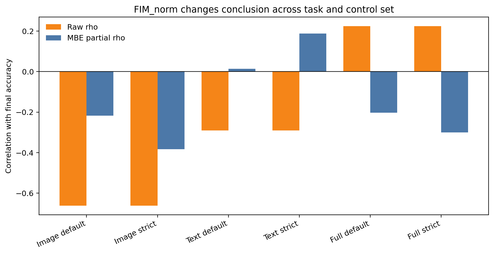
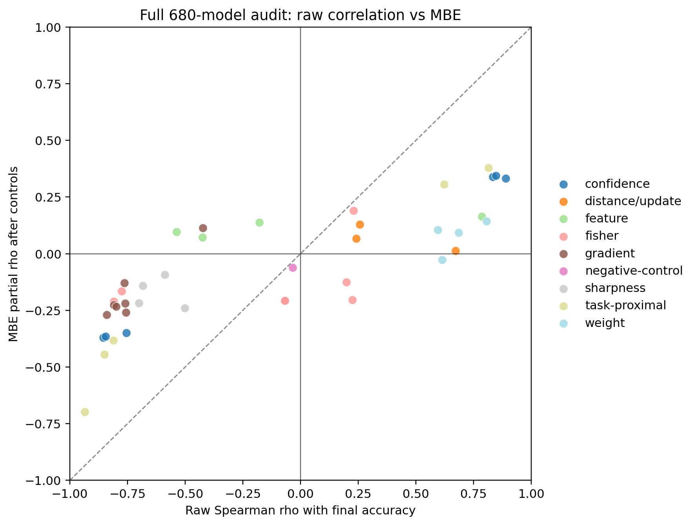
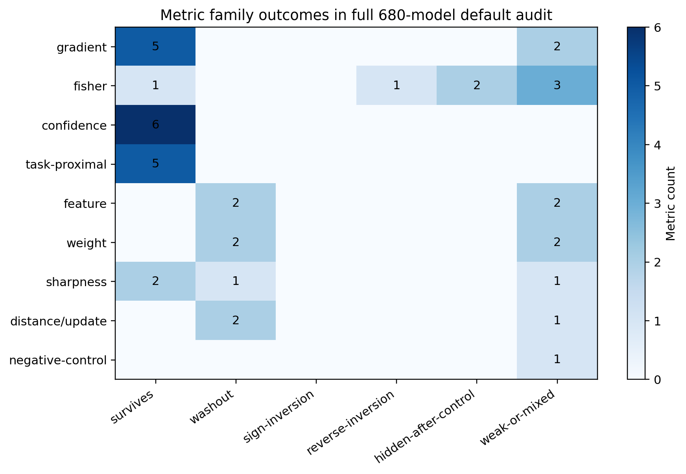
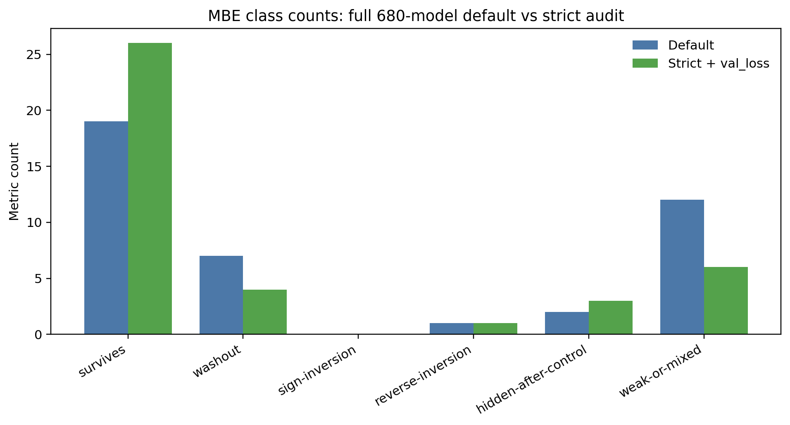

# Figures

These figures are generated from saved CSV summaries only. No model training is
required.

Regenerate:

```bash
python figures/generate_figures.py
```

## FIM_norm Across Contexts



What it shows:

- FIM_norm survives in image-only audits.
- It washes out or weakens in text-only audits.
- It reverses in the full pooled image+text setting.
- The result is task- and pooling-sensitive rather than uniformly good or bad.

## Raw Correlation vs MBE



What it shows:

- Raw pooled correlation and MBE partial correlation can disagree sharply.
- Metrics below the diagonal lose signal after controls.
- Family colors make it easier to see which metric families are fragile.

## Metric Family Outcome Heatmap



What it shows:

- MBE is selective.
- Several families retain surviving metrics.
- Feature, weight, distance/update, and some geometry metrics are visibly
  control-sensitive.

## Default vs Strict Class Counts



What it shows:

- Adding validation loss changes the audit question.
- Strict MBE does not kill all metrics.
- Several metrics still survive after strong controls.
